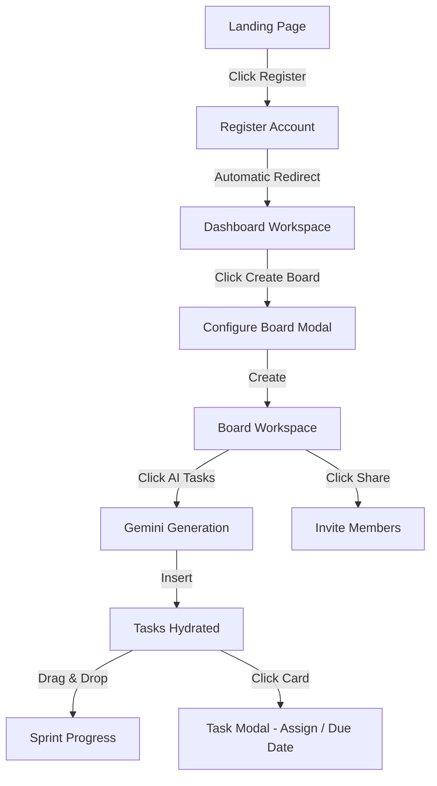

# Kanboard — User Journey & Flows

This document details the step-by-step user journey, explaining how customers interact with the interface to complete projects.

---

## 📈 The Standard User Journey

---

## 🔍 Detailed User Scenarios

### Scenario 1: Onboarding & First Board
1.  **Registration**: A new user visits `http://localhost:5173/` and is presented with a landing page highlighting Gemini AI features.
2.  **Account Creation**: User clicks "Start now" and enters their name, email, and password. Upon successful registration, the JWT is saved, and the client transitions to `/dashboard`.
3.  **Create Board**: The user clicks **Create Board** button. A modal requests:
    *   Title (e.g. "Q3 Launch Plan").
    *   Description ("Launch roadmap").
    *   Color Theme (selects violet color).
4.  **Auto-Redirect**: The new board is successfully created, and the user is redirected to `/board/:id`. Four default columns are created automatically: `Todo`, `In Progress`, `Review`, and `Done`.

### Scenario 2: Planning with AI
1.  **Generate Backlog**: The user has an empty board. They click the **AI Tasks** button.
2.  **Input Goal**: A prompt modal appears: "What is your project goal?" The user enters: "Create a mobile delivery application".
3.  **Draft Roadmap**: The user selects a count (e.g. 8 tasks) and clicks **Generate**. The Express server contacts Gemini, receives a parsed list, and inserts the tasks into the `Todo` column.
4.  **Deconstruct a Task**: The user clicks on the generated card "Set up Google Maps integration". The task modal opens. The user clicks **AI Breakdown**.
5.  **Subtasks Check**: Gemini generates a list of 5 subtasks (e.g., "Get API key", "Install SDK", "Configure permissions"). These are appended to the task's description as a checkable markdown checklist.

### Scenario 3: Real-Time Team Collaboration
1.  **Invite Member**: The user clicks the **Members** button in the board top bar. They search `diego@kanboard.dev` and click **Invite** as an `Admin`.
2.  **Teammate joins**: Diego logs in on his own machine. In his dashboard under "Shared with You", he sees the new board and clicks on it.
3.  **Live Presence**: Diego's avatar appears in the top navigation bar of the first user's browser, indicating that Diego is active on this board.
4.  **Task Assignment**: The first user opens the "Maps Integration" task and selects **Diego Santos** from the assignee dropdown. Diego's browser updates in real time, displaying his avatar on the card.
5.  **Move Task**: Diego drags the task card from the `Todo` column into the `In Progress` column. The card slides across the first user's screen automatically.
