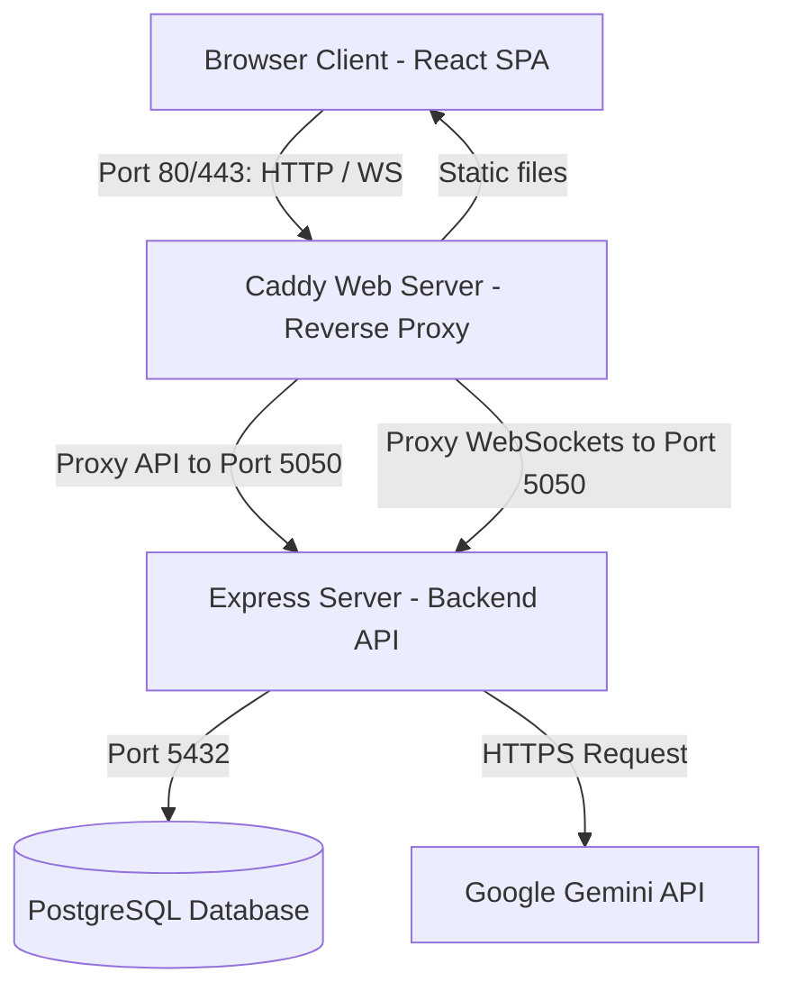
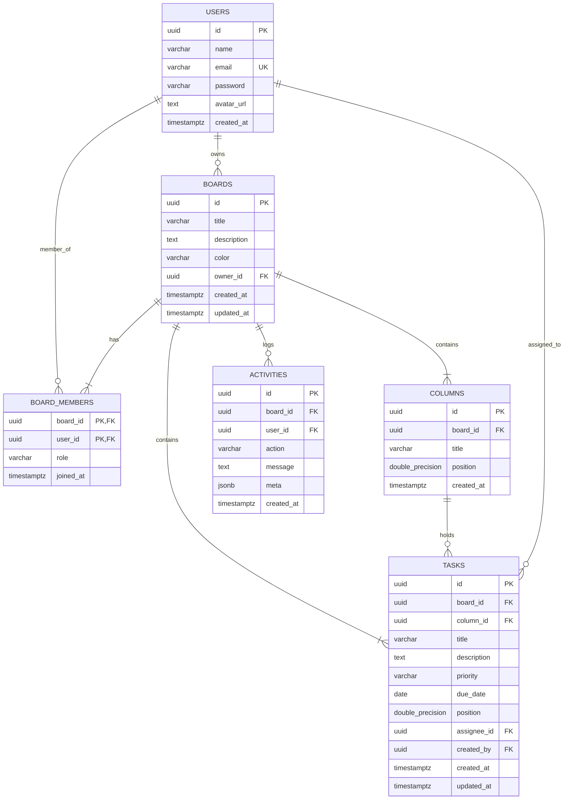
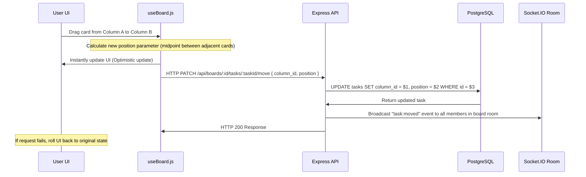
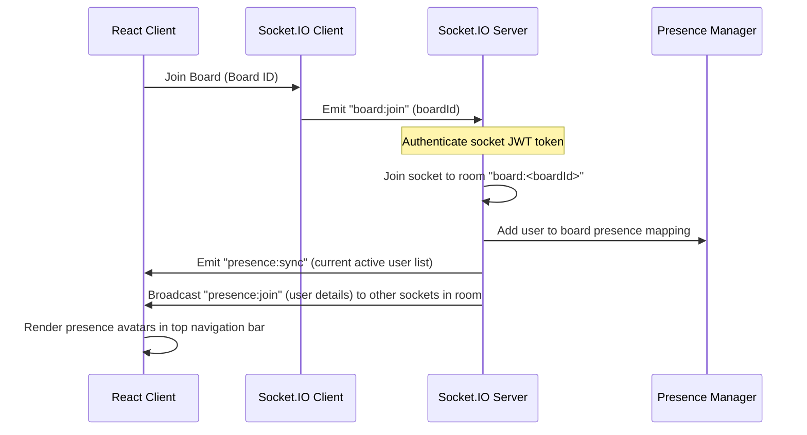
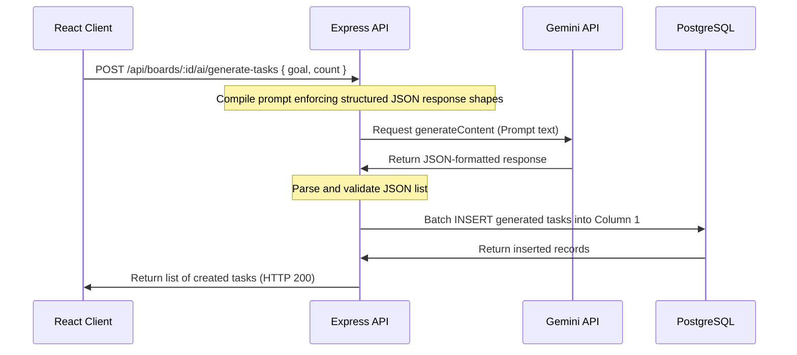

# Kanboard — System Architecture & Flows

This document details the high-level architecture, database schema, and operational lifecycles of the Kanboard application. It serves as a guide to help developers and AI agents understand the codebase design.

---

## 🏛️ High-Level System Architecture

Kanboard uses a **three-tier architecture** containerized via Docker for execution consistency:

---

## 💾 Database Schema

The PostgreSQL database stores 6 tables with foreign keys and cascade deletions.

---

## 🔄 Core Operational Lifecycles

### 1. Drag-and-Drop Reordering Lifecycle
To ensure performance feels instantaneous, Kanboard uses **optimistic UI updates** combined with backend persistence.

### 2. Live Presence Tracking Lifecycle
The real-time collaboration and presence system uses **Socket.IO** rooms to track active users.

### 3. Google Gemini AI Generation Flow
The system queries the `gemini-2.0-flash` model using structured JSON prompts.

